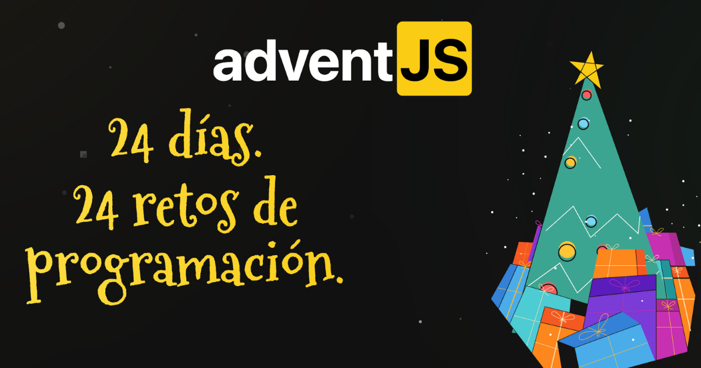

# **_AdventJS_** 2021

## 25 retos en _JavaScript_. Hay retos para todos: fáciles, moderados, difíciles y muy difíciles también! (2021)

> Creador: Midudev 
  > [@midudev](https://twitter.com/midudev) 
  > en [AdventsJsChallenges](https://adventjs.dev/)

---
1. ### Contando ovejas para dormir 🐑 [<01>](Reto-01/README.md)
2. ### ¡Ayuda al elfo a listar los regalos! 🧝 [<02>](Reto-02/README.md)
3. ### El Grinch quiere fastidiar la Navidad 🎁 [<03>](Reto-03/README.md)
4. ### ¡Es hora de poner la navidad en casa! 🎄 [<04>](Reto-04/README.md)
5. ### Contando los días para los regalos 📅 [<05>](Reto-05/README.md)
6. ### Rematando los exámenes finales 🤓 [<06>](Reto-06/README.md)
7. ### Buscando en el almacén... 🏪 [<07>](Reto-07/README.md)
8. ### La locura de las criptomonedas 🪙 [<08>](Reto-08/README.md)
9. ### ¡Es hora de poner la navidad en casa! 🎅 [<09>](Reto-09/README.md)
10. ### La máquina de cambio 🎰 [<10>](Reto-10/README.md)
11. ### ¿Vale la pena la tarjeta de fidelidad del cine? 🎬 [<11>](Reto-11/README.md)
12. ### La ruta perfecta para dejar los regalos 🛣️ [<12>](Reto-12/README.md)
13. ### Envuelve regalos con asteriscos 💥 [<13>](Reto-13/README.md)
14. ### En busca del reno perdido 🦌 [<14>](Reto-14/README.md)
15. ### El salto perfecto 🏃 [<15>](Reto-15/README.md)
16. ### Descifrando los números... 🔢 [<16>](Reto-16/README.md)
17. ### La locura de enviar paquetes en esta época 📦 [<17>](Reto-17/README.md)
18. ### El sistema operativo de Santa Claus 📱 [<18>](Reto-18/README.md)
19. ### ¿Qué deberíamos aprender en Platzi? 📚 [<19>](Reto-19/README.md)
20. ### ¿Una carta de pangramas? ¡QUÉ! 📝 [<20>](Reto-20/README.md)
21. ### La ruta con los regalos ⛐ [<21>](Reto-21/README.md)
22. ### ¿Cuántos adornos necesota el árbol? 🌳 [<22>](Reto-22/README.md)
23. ### ¿Puedes reconfigurar las fábricas para no parar de crear? 🔨 [<23>](Reto-23/README.md)
24. ### Comparando árboles de navidad 🎄 [<24>](Reto-24/README.md)
25. ### El último juego y hasta el año que viene 🎉 [<25>](Reto-25/README.md)
 
 
 
 

---
# **_AdventJS_** 2022

## 24 retos en _JavaScript_. Hay retos para todos: fáciles, moderados, difíciles y muy difíciles también! (2022)

> Creador: Midudev 
  > [@midudev](https://twitter.com/midudev) 
  > en [AdventsJsChallenges](https://adventjs.dev/)

---
1. ### ¡Automatizando envolver regalos de navidad! 🖨️ [<01>](adventJS2022/Reto-01/README.md)
2. ### Nadie quiere hacer horas extra ⌚ [<02>](adventJS2022/Reto-02/README.md)
---
###### *Franco Siccatto* [@FSikkario](https://twitter.com/FSikkario)
---
